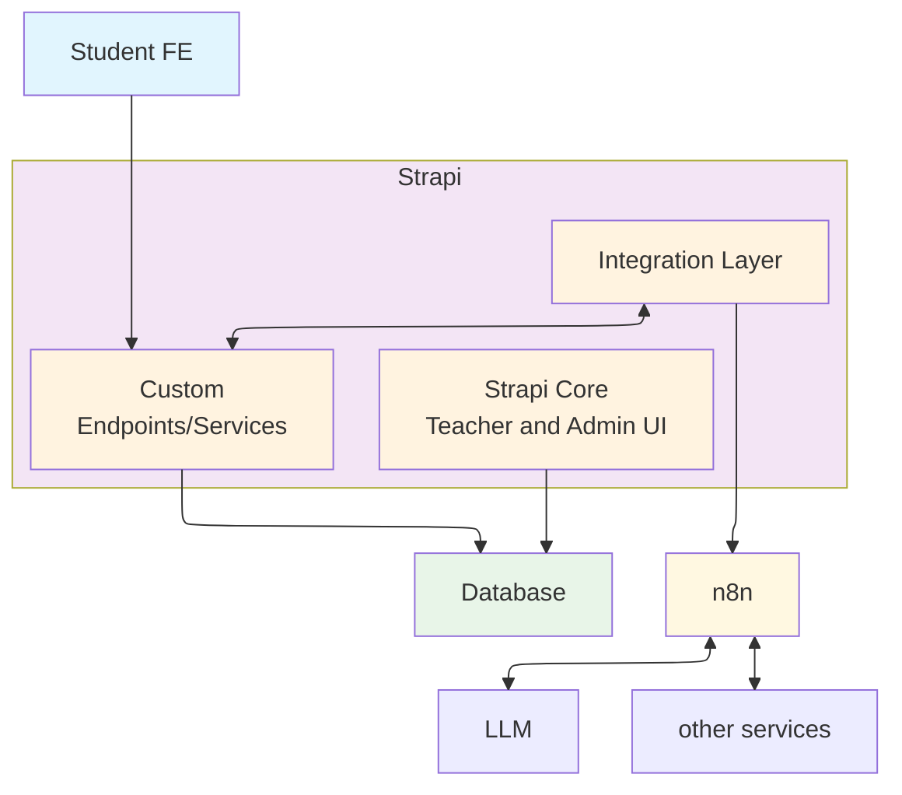

```mermaid
flowchart-elk TD
    A[Student FE] --> B2
    
    subgraph B[Strapi]
        B1[Strapi Core<br>Teacher and Admin UI]
        B2[Custom <br>Endpoints/Services]
        B3[Integration Layer]
    end
    
    B1 --> C[Database]
    B2 --> C
    B3 --> D[n8n]
    B3 <--> B2
    D <-->E[LLM]
    D <-->F[other services]
    
    style A fill:#e1f5fe
    style B fill:#f3e5f5
    style B1 fill:#fff3e0
    style B2 fill:#fff3e0
    style B3 fill:#fff3e0
    style C fill:#e8f5e8
    style D fill:#fff8e1

```