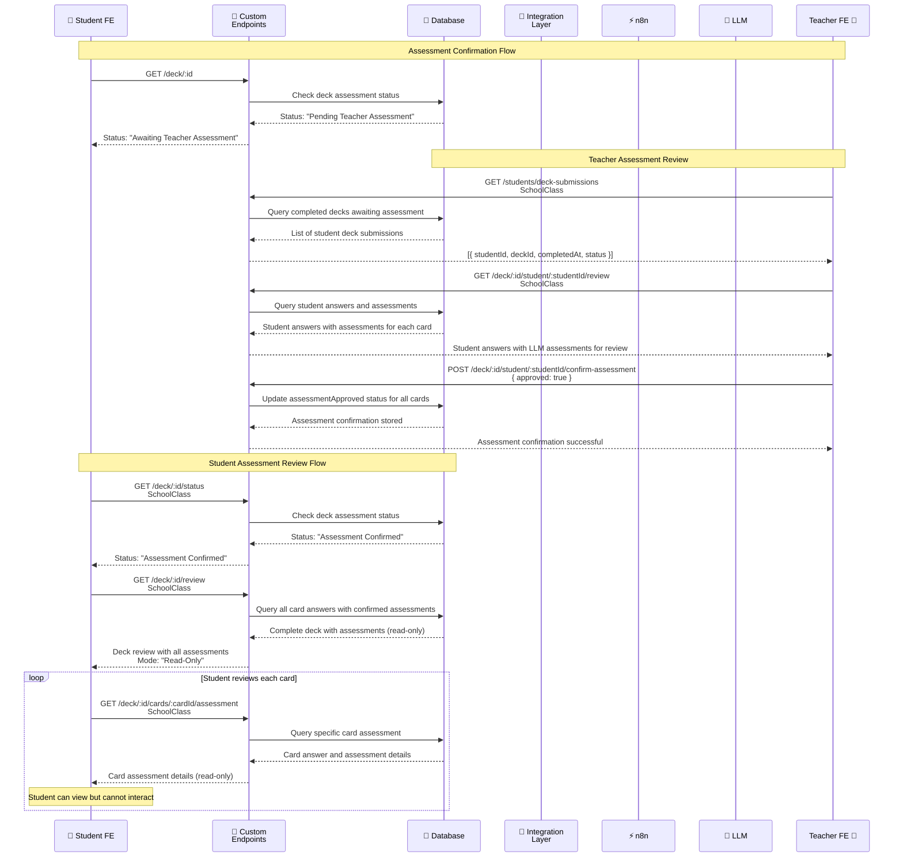

```mermaid
sequenceDiagram
    participant S as 👤 Student FE
    participant StrapiCustom as 🔐 Custom<br>Endpoints
    participant DB as 💾 Database
    participant IntegrationLayer as 🔧 Integration<br>Layer
    participant N8N as ⚡ n8n
    participant LLM as 🤖 LLM
    participant T as  Teacher FE 👤

    Note over S, T: Assessment Confirmation Flow
    S->>StrapiCustom: GET /deck/:id
    StrapiCustom->>DB: Check deck assessment status
    DB-->>StrapiCustom: Status: "Pending Teacher Assessment"
    StrapiCustom-->>S: Status: "Awaiting Teacher Assessment"

    Note over T, DB: Teacher Assessment Review
    T->>StrapiCustom: GET /students/deck-submissions<br/>SchoolClass
    StrapiCustom->>DB: Query completed decks awaiting assessment
    DB-->>StrapiCustom: List of student deck submissions
    StrapiCustom-->>T: [{ studentId, deckId, completedAt, status }]

    T->>StrapiCustom: GET /deck/:id/student/:studentId/review<br/>SchoolClass
    StrapiCustom->>DB: Query student answers and assessments
    DB-->>StrapiCustom: Student answers with assessments for each card
    StrapiCustom-->>T: Student answers with LLM assessments for review

    T->>StrapiCustom: POST /deck/:id/student/:studentId/confirm-assessment<br/>{ approved: true }
    StrapiCustom->>DB: Update assessmentApproved status for all cards
    DB-->>StrapiCustom: Assessment confirmation stored
    StrapiCustom-->>T: Assessment confirmation successful

    Note over S, DB: Student Assessment Review Flow
    S->>StrapiCustom: GET /deck/:id/status<br/>SchoolClass
    StrapiCustom->>DB: Check deck assessment status
    DB-->>StrapiCustom: Status: "Assessment Confirmed"
    StrapiCustom-->>S: Status: "Assessment Confirmed"

    S->>StrapiCustom: GET /deck/:id/review<br/>SchoolClass
    StrapiCustom->>DB: Query all card answers with confirmed assessments
    DB-->>StrapiCustom: Complete deck with assessments (read-only)
    StrapiCustom-->>S: Deck review with all assessments<br/>Mode: "Read-Only"

    loop Student reviews each card
        S->>StrapiCustom: GET /deck/:id/cards/:cardId/assessment<br/>SchoolClass
        StrapiCustom->>DB: Query specific card assessment
        DB-->>StrapiCustom: Card answer and assessment details
        StrapiCustom-->>S: Card assessment details (read-only)
        Note over S: Student can view but cannot interact
    end
```
