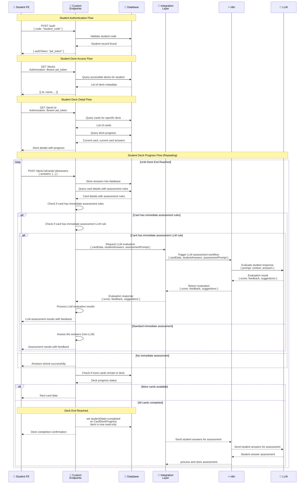

```mermaid
sequenceDiagram
    participant S as 👤 Student FE
    participant StrapiCustom as 🔐 Custom<br>Endpoints
    participant DB as 💾 Database
    participant IntegrationLayer as 🔧 Integration<br>Layer
    participant N8N as ⚡ n8n
    participant LLM as 🤖 LLM

    Note over S, DB: Student Authentication Flow
    S->>StrapiCustom: POST /auth<br/>{ code: "student_code" }
    StrapiCustom->>DB: Validate student code
    DB-->>StrapiCustom: Student record found
    StrapiCustom-->>S: { authToken: "jwt_token" }

    Note over S, DB: Student Deck Access Flow
    S->>StrapiCustom: GET /decks<br/>Authorization: Bearer jwt_token
    StrapiCustom->>DB: Query accessible decks for student
    DB-->>StrapiCustom: List of deck metadata
    StrapiCustom-->>S: [{ id, name,... }]

    Note over S, DB: Student Deck Detail Flow
    S->>StrapiCustom: GET /deck/:id<br/>Authorization: Bearer jwt_token
    StrapiCustom->>DB: Query cards for specific deck
    DB-->>StrapiCustom: List of cards
    StrapiCustom->>DB: Query deck progress
    DB-->>StrapiCustom: Current card, current card answers
    StrapiCustom-->>S: Deck details with progress

    Note over S, LLM: Student Deck Progress Flow (Repeating)
    loop Until Deck End Reached
        S->>StrapiCustom: POST /deck/:id/cards/:id/answers<br/>{ answers: [...] }
        StrapiCustom->>DB: Store answers into database
        StrapiCustom->>DB: Query card details with assessment rules
        DB-->>StrapiCustom: Card details with assessment rules
        StrapiCustom->>StrapiCustom: Check if card has immediate assessment rules
        alt Card has immediate assessment rules
            StrapiCustom->>StrapiCustom: Check if card has immediate assessment LLM rule
            alt Card has immediate assessment LLM rule
                StrapiCustom->>IntegrationLayer: Request LLM evaluation<br/>{ cardData, studentAnswers, assessmentPrompt }
                IntegrationLayer->>N8N: Trigger LLM assessment workflow<br/>{ cardData, studentAnswers, assessmentPrompt }
                N8N->>LLM: Evaluate student response<br/>{ prompt, context, answers }
                LLM-->>N8N: Evaluation result<br/>{ score, feedback, suggestions }
                N8N-->>IntegrationLayer: Return evaluation<br/>{ score, feedback, suggestions }
                IntegrationLayer-->>StrapiCustom: Evaluation response<br/>{ score, feedback, suggestions }
                StrapiCustom->>StrapiCustom: Process LLM evaluation results
                StrapiCustom-->>S: LLM assessment results with feedback
            else Standard immediate assessment
                StrapiCustom->>StrapiCustom: Assess the answers (non-LLM)
                StrapiCustom-->>S: Assessment results with feedback
            end
        else No immediate assessment
            StrapiCustom-->>S: Answers stored successfully
        end
        StrapiCustom->>DB: Check if more cards remain in deck
        DB-->>StrapiCustom: Deck progress status
        alt More cards available
            StrapiCustom-->>S: Next card data
        else All cards completed
            Note over S, DB: Deck End Reached,
            StrapiCustom-->>DB: set studentState=completed <br>on CardDeckProgress<br>deck is now read-only
            StrapiCustom-->>S: Deck completion confirmation
            IntegrationLayer -->> N8N:Send student answers for assessment
            N8N -->> LLM:Send student answers for assessment
            LLM -->> N8N: Student answer assessment
            N8N -->> IntegrationLayer: process and store assessment
        end
    end

```
