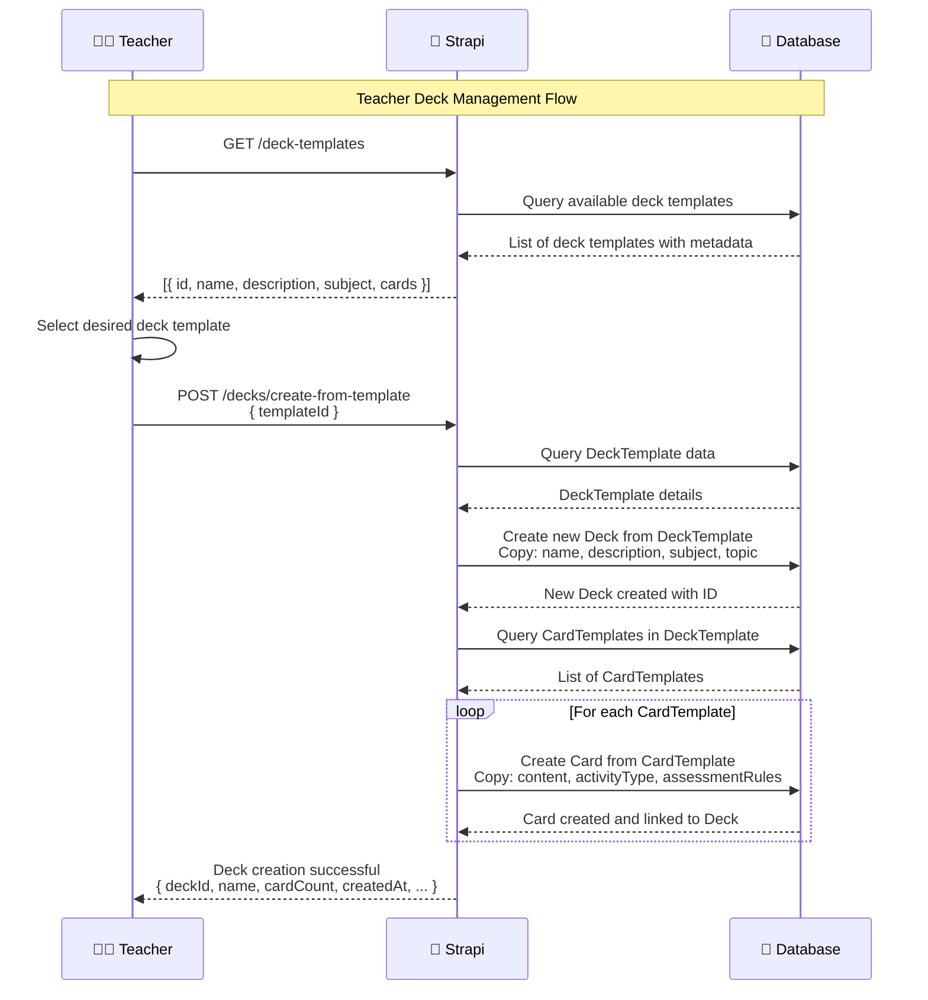

```mermaid
sequenceDiagram
    participant T as 👨‍🏫 Teacher
    participant Strapi as 🔐 Strapi
    participant DB as 💾 Database

    Note over T, DB: Teacher Deck Management Flow
    T->>Strapi: GET /deck-templates<br/>
    Strapi->>DB: Query available deck templates
    DB-->>Strapi: List of deck templates with metadata
    Strapi-->>T: [{ id, name, description, subject, cards }]

    T->>T: Select desired deck template
    T->>Strapi: POST /decks/create-from-template<br/>{ templateId }

    Strapi->>DB: Query DeckTemplate data
    DB-->>Strapi: DeckTemplate details

    Strapi->>DB: Create new Deck from DeckTemplate<br/>Copy: name, description, subject, topic
    DB-->>Strapi: New Deck created with ID

    Strapi->>DB: Query CardTemplates in DeckTemplate
    DB-->>Strapi: List of CardTemplates

    loop For each CardTemplate
        Strapi->>DB: Create Card from CardTemplate<br/>Copy: content, activityType, assessmentRules
        DB-->>Strapi: Card created and linked to Deck
    end


    Strapi-->>T: Deck creation successful<br/>{ deckId, name, cardCount, createdAt, ... }
```
