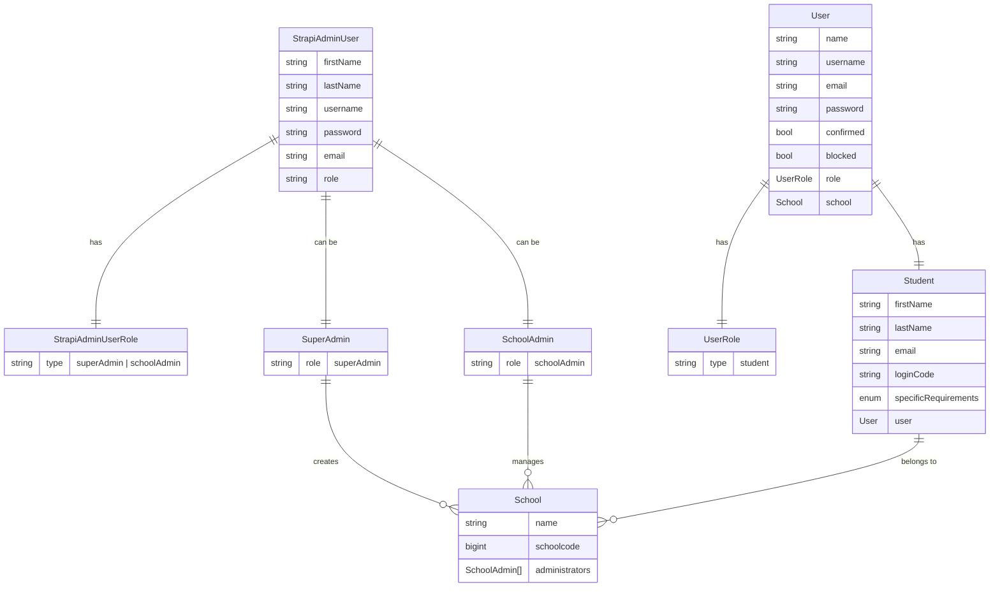

## User Roles

- for administrator users (School admins and Superadmins) we use Strapi admin users with appropriate roles
  - `SuperAdmin` has access to all content
  - `SchoolAdmin` has access to content from their school
    - to enable this, school admins need to be manually linked to `School` by SuperAdmins
    - the relation will be managed on `School` collection type's side - extending admin users is not supported
- `Student` entities are linked to default `User` collection type
  - this enables us to leverage authentication and authorization already available in Strapi
  - each `Student` needs to be linked with an item in `User` collection type
    - done automatically via document middleware
    - when `Student` is created, corresponding `User` entity will be created in the background copying required information from `Student`

