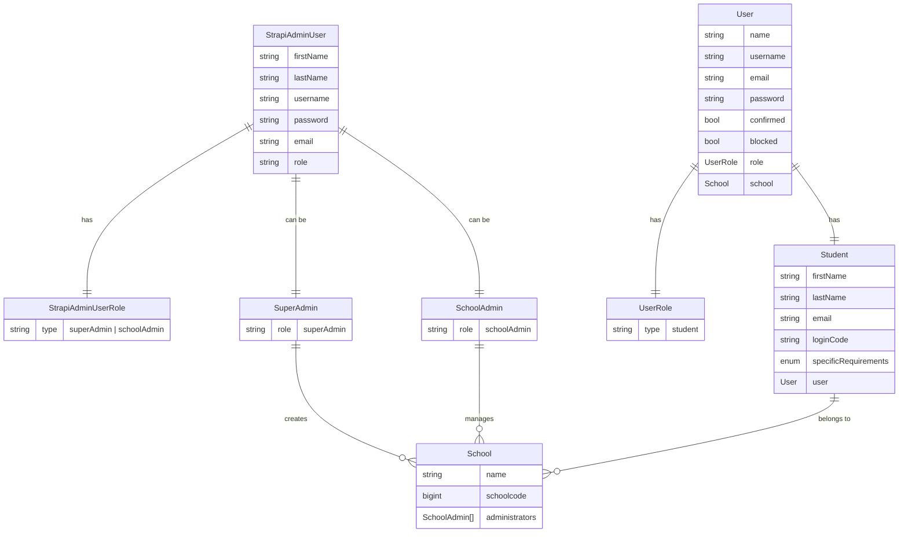

```mermaid
erDiagram
  StrapiAdminUser {
    string firstName
    string lastName
    string username
    string password
    string email
    string role
  }

  StrapiAdminUserRole {
    string type "superAdmin | schoolAdmin"
  }

  SuperAdmin {
    string role "superAdmin"
  }

  SchoolAdmin {
    string role "schoolAdmin"
  }

  User {
    string name
    string username
    string email
    string password
    bool confirmed
    bool blocked
    UserRole role
    School school
  }

  UserRole {
    string type "student"
  }

  Student {
    string firstName
    string lastName
    string email
    string loginCode
    enum specificRequirements
    User user
  }

  School {
    string name
    bigint schoolcode
    SchoolAdmin[] administrators
  }

  StrapiAdminUser ||--|| StrapiAdminUserRole: "has"
  StrapiAdminUser ||--|| SuperAdmin: "can be"
  StrapiAdminUser ||--|| SchoolAdmin: "can be"
  User ||--|| UserRole: "has"
  User ||--|| Student: "has"
  SuperAdmin ||--o{ School: "creates"
  SchoolAdmin ||--o{ School: "manages"
  Student ||--o{ School: "belongs to"

```
