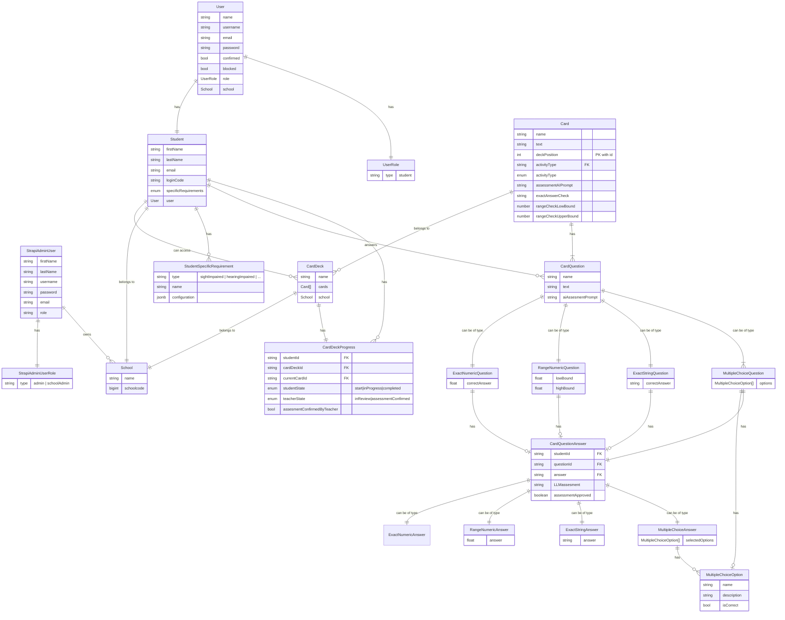

```mermaid
erDiagram
  StrapiAdminUser {
    string firstName
    string lastName
    string username
    string password
    string email
    string role
  }

  StrapiAdminUserRole {
    string type "admin | schoolAdmin"
  }

  User {
    string name
    string username
    string email
    string password
    bool confirmed
    bool blocked
    UserRole role
    School school
  }

  UserRole {
    string type "student"
  }

  Student {
    string firstName
    string lastName
    string email
    string loginCode
    enum specificRequirements
    User user
  }

  StudentSpecificRequirement {
    string type "sightImpaired | hearingImpaired | ..."
    string name
    jsonb configuration
  }

  School {
    string name
    bigint schoolcode
  }

  CardDeck {
    string name
    Card[] cards
    School school
  }

  CardDeckProgress {
    string studentId FK
    string cardDeckId FK
    string currentCardId FK
    enum studentState "start|inProgress|completed"
    enum teacherState "inReview|assessmentConfirmed"
    bool assesmentConfirmedByTeacher
  }

  Card {
    string name
    string text
    int deckPosition "PK with id"
    string activityType FK
    enum activityType
    string assessmentAIPrompt
    string exactAnswerCheck
    number rangeCheckLowBound
    number rangeCheckUpperBound
  }

  CardQuestion {
    string name
    string text
    string aiAssesmentPrompt
  }

  ExactNumericQuestion {
    float correctAnswer
  }

  RangeNumericQuestion {
    float lowBound
    float highBound
  }

  RangeNumericAnswer {
    float answer
  }

  ExactStringQuestion {
    string correctAnswer
  }

  ExactStringAnswer {
    string answer
  }

  MultipleChoiceOption {
    string name
    string description
    bool isCorrect
  }

  MultipleChoiceQuestion {
    MultipleChoiceOption[] options
  }

  MultipleChoiceAnswer {
    MultipleChoiceOption[] selectedOptions
  }


  CardQuestionAnswer {
    string studentId FK
    string questionId FK
    string answer FK
    string LLMassesment
    boolean assessmentApproved
  }

  StrapiAdminUser ||--|| StrapiAdminUserRole: "has"
  StrapiAdminUser ||--o{ School: "owns"
  CardDeck ||--|| School: "belongs to"
  CardDeck ||--|| CardDeckProgress: "has"
  CardDeckProgress }o--|| Student: "has"
  Card ||--o{ CardDeck: "belongs to"
  Card ||--|{ CardQuestion: "has"
  CardQuestion ||--|| ExactNumericQuestion: "can be of type"
  CardQuestion ||--|| RangeNumericQuestion: "can be of type"
  CardQuestion ||--|| ExactStringQuestion: "can be of type"
  CardQuestion ||--|{ MultipleChoiceQuestion: "can be of type"
  ExactNumericQuestion ||--o| CardQuestionAnswer: "has"
  RangeNumericQuestion ||--o| CardQuestionAnswer: "has"
  ExactStringQuestion ||--o| CardQuestionAnswer: "has"
  MultipleChoiceQuestion ||--o| MultipleChoiceOption: "has"
  MultipleChoiceQuestion ||--|| CardQuestionAnswer: "has"
  CardQuestionAnswer ||--|| ExactNumericAnswer: "can be of type"
  CardQuestionAnswer ||--|| RangeNumericAnswer: "can be of type"
  CardQuestionAnswer ||--|| ExactStringAnswer: "can be of type"
  CardQuestionAnswer ||--|| MultipleChoiceAnswer: "can be of type"
  MultipleChoiceAnswer ||--o{ MultipleChoiceOption: "has"
  User ||--|| Student: "has"
  User ||--|| UserRole: "has"
  Student ||--o{ CardDeck: "can access"
  Student ||--|| School: "belongs to"
  Student ||--o{ StudentSpecificRequirement: "has"
  Student ||--o{ CardQuestion: "answers"

```
