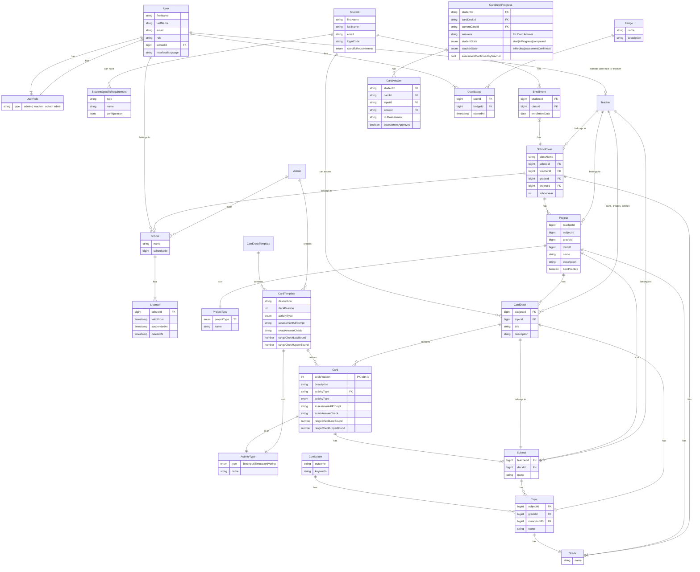

```mermaid
erDiagram
    User {
        string firstName
        string lastName
        string email
        string role
        bigint schoolId FK
        string interfacelanguage

    }

    UserRole {
        string type "admin | teacher | school admin"
    }

    Admin {

    }

    Student {
        string firstName
        string lastName
        string email
        string loginCode
        enum specificRequirements
    }


    StudentSpecificRequirement {
        string type
        string name
        jsonb configuration
    }

    Teacher {
    }

    School {
        string name
        bigint schoolcode
    }

    Licence {
        bigint schoolId FK
        timestamp validFrom
        timestamp suspendedAt
        timestamp deletedAt
    }

    Enrollment {
        bigint studentId FK
        bigint classId  FK
        date enrollmentDate
    }

    SchoolClass {
        string className
        bigint schoolId FK
        bigint teacherId FK
        bigint gradeId FK
        bigint projectId FK
        int schoolYear
    }

    Grade {
        string name
    }

    Project {
        bigint teacherId
        bigint subjectId
        bigint gradeId
        bigint deckId
        string name
        string description
        boolean bestPractice
    }

    ProjectType {
        enum projectType "??"
        string name
    }


    CardDeck {
        bigint subjectId FK
        bigint topicId FK
        string title
        string description
    }

    CardDeckProgress {
        string studentId FK
        string cardDeckId FK
        string currentCardId FK
        string answers "FK Card Answer"
        enum studentState "start|inProgress|completed"
        enum teacherState "inReview|assesmentConfirmed"
        bool assesmentConfirmedByTeacher
    }

    CardAnswer {
        string studentId FK
        string cardId FK
        string inputId FK
        string answer FK
        string LLMassesment
        boolean assessmentApproved
    }

    CardTemplate {
        string description
        int deckPosition
        enum activityType
        string assessmentAIPrompt
        string exactAnswerCheck
        number rangeCheckLowBound
        number rangeCheckUpperBound
    }

    Card {
        int deckPosition "PK with id"
        string description
        string activityType FK
        enum activityType
        string assessmentAIPrompt
        string exactAnswerCheck
        number rangeCheckLowBound
        number rangeCheckUpperBound
    }

    ActivityType {
        enum type "TextInput|Simulation|Voting"
        string name
    }

    Subject{
        bigint teacherId FK
        bigint deckId FK
        string name
    }

    Topic{
        bigint subjectId FK
        bigint gradeId FK
        bigint curriculumID FK
        string name
    }

    Curriculum {
        string outcome
        string keywords
    }

    Badge {
        string name
        string description
    }

    UserBadge {
        bigint userId FK
        bigint badgeId FK
        timestamp earnedAt
    }


    User ||--|| UserRole : "has"
    User ||--o| Teacher : "extends when role is 'teacher'"

    Admin ||--o{ School: "owns"
    Admin ||--o{ CardTemplate: "creates"

    Teacher ||--o{ CardDeck : "owns, creates, deletes"
    Teacher ||--o{ SchoolClass: "belongs to"
    Teacher ||--o{ Subject: "belongs to"
    Teacher ||--o{ Project: "belongs to"


    SchoolClass ||--o| School: "belongs to"
    School ||--|{ Licence: "has"
    SchoolClass ||--|{ Grade: "has"
    SchoolClass ||--|{ Project: "has"

    Project ||--|| ProjectType: "is of"
    Project ||--|| Subject: "is of"
    Project ||--|{ CardDeck: "has"
    Project ||--|{ Grade: "has"

    CardDeck ||--o{ Card: "contains"
    CardDeck ||--|| Subject: "belongs to"
    CardDeck ||--|| Topic: "has"

    Student ||--|{ Enrollment: "has"
    Enrollment }|--|| SchoolClass: "has"
    Student ||--o{ StudentSpecificRequirement: "can have"

    Student ||--o{ CardDeck: "can access"

    CardDeckTemplate ||--o{ CardTemplate: "contains"
    CardTemplate ||--|| ActivityType: "is of"
    CardTemplate ||--o{ Card: "defines"

    CardDeckProgress ||--o{ CardAnswer: "has"

    Subject ||--o{ Topic: "has"

    Topic ||--|| Grade: "has"

    Curriculum ||--o{ Topic: "has"


    Card ||--|{ Subject: "has"
    Card ||--|| ActivityType: "is of"

    User ||--|{ UserRole : "has"
    User ||--o{ School : "belongs to"

    Badge ||--|{ UserBadge: "has"
    User ||--|{ UserBadge: "has"
```
