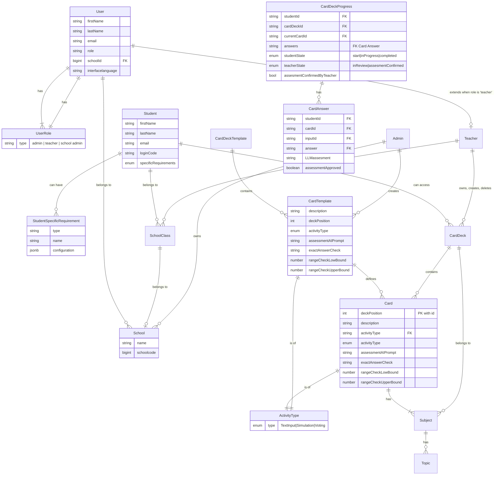

```mermaid
erDiagram
    User {
        string firstName
        string lastName
        string email
        string role
        bigint schoolId FK
        string interfacelanguage

    }

    UserRole {
        string type "admin | teacher | school admin"
    }

    Admin {

    }

    Student {
        string firstName
        string lastName
        string email
        string loginCode
        enum specificRequirements
    }


    StudentSpecificRequirement {
        string type
        string name
        jsonb configuration
    }

    Teacher {
    }

    School {
        string name
        bigint schoolcode

    }

    SchoolClass {

    }


    CardDeck {

    }

    CardDeckProgress {
        string studentId FK
        string cardDeckId FK
        string currentCardId FK
        string answers "FK Card Answer"
        enum studentState "start|inProgress|completed"
        enum teacherState "inReview|assesmentConfirmed"
        bool assesmentConfirmedByTeacher
    }

    CardAnswer {
        string studentId FK
        string cardId FK
        string inputId FK
        string answer FK
        string LLMassesment
        boolean assessmentApproved
    }

    CardTemplate {
        string description
        int deckPosition
        enum activityType
        string assessmentAIPrompt
        string exactAnswerCheck
        number rangeCheckLowBound
        number rangeCheckUpperBound
    }

    Card {
        int deckPosition "PK with id"
        string description
        string activityType FK
        enum activityType
        string assessmentAIPrompt
        string exactAnswerCheck
        number rangeCheckLowBound
        number rangeCheckUpperBound
    }

    ActivityType {
        enum type "TextInput|Simulation|Voting"
    }

    Subject{

    }

    Topic{

    }


    User ||--|| UserRole : "has"
    User ||--o| Teacher : "extends when role is 'teacher'"

    Admin ||--o{ School: "owns"
    Admin ||--o{ CardTemplate: "creates"

    Teacher ||--o{ CardDeck : "owns, creates, deletes"
    Teacher ||--o{ SchoolClass: "belongs to"


    SchoolClass ||--o| School: "belongs to"

    CardDeck ||--o{ Card: "contains"
    CardDeck ||--o{ Subject: "belongs to"

    Student ||--o{ StudentSpecificRequirement: "can have"
    Student ||--o{ SchoolClass: "belongs to"
    Student ||--o{ CardDeck: "can access"

    CardDeckTemplate ||--o{ CardTemplate: "contains"
    CardTemplate ||--|| ActivityType: "is of"
    CardTemplate ||--o{ Card: "defines"

    CardDeckProgress ||--o{ CardAnswer: "has"

    Subject ||--o{ Topic: "has"


    Card ||--|{ Subject: "has"
    Card ||--|| ActivityType: "is of"

    User ||--|{ UserRole : "has"
    User ||--o{ School : "belongs to"
```
